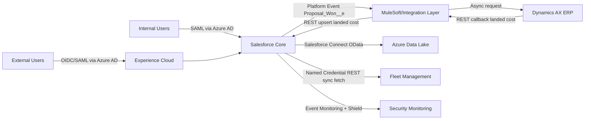

# BuildRight Logistics - High Level Design (HLD)

## 1) Executive Summary

BuildRight Logistics is moving from a legacy .NET platform to Salesforce for high-volume proposal and service operations (1.5M active proposals, 4M audits, 2.5M order line items/year). The architecture must support:

- high data volume (LDV) and long-term history access,
- strict data segregation across agencies and government opportunities,
- delayed ERP pricing callback (3-5 minutes),
- external user authentication with Azure AD and social IdPs,
- controlled migration with deduplication and zero ERP overload.

This design uses a **single Salesforce org** with **data virtualization + event-driven integration + layered sharing controls**, and a migration strategy that creates clean golden records before loading.

---

## 2) Scope and Assumptions

### In Scope

- Sales Cloud, Service Cloud, Experience Cloud
- Salesforce Shield controls
- Integration with Dynamics AX, Azure Data Lake, Fleet system, Azure AD
- Data migration and migration 2.0 cutover strategy
- DevOps pipeline and environment strategy

### Assumptions

- Azure Data Lake exposes OData 4.0 endpoints suitable for Salesforce Connect external objects.
- Dynamics AX provides async callback API endpoint integration.
- Procurement agencies and site managers are Experience Cloud users.
- Customer identity lifecycle remains outside Salesforce (Azure AD B2B/B2C + social federation).

---

## 3) Architecture Principles

1. **Keep transactional data in Salesforce, historical bulk data virtualized**.
2. **Use asynchronous integration for slow ERP processing**.
3. **Apply least-privilege sharing with deny-by-default design**.
4. **Stop bad data before persistence (dedup + validation)**.
5. **Separate migration controls from runtime automation**.
6. **Design for operability (observability, retries, replay, auditability)**.

---

## 4) Target System Landscape

### Integration Pattern Map

| Interface | Pattern | Protocol/Format | Why |
|---|---|---|---|
| Salesforce -> AX (Closed Won) | Event-driven async | Platform Event -> Middleware (JSON) | AX processing takes 3-5 min; async avoids timeout/governor risks |
| AX -> Salesforce landed cost | Request-reply callback | REST JSON | deterministic writeback to Opportunity |
| Salesforce -> Azure Data Lake history | Data virtualization | OData 4.0 | no replication, searchable related history, lower storage overhead |
| Salesforce Case UI -> Fleet status | UI mashup sync read | REST JSON | real-time view needed, no persistent storage required |
| Identity Federation | Browser SSO | SAML for workforce, OIDC for modern web/mobile/social | strongest compatibility with Azure AD and Experience Cloud use cases |

---

## 5) Identity, Authentication, Authorization

## 5.1 SAML vs OIDC Decision

- **Internal workforce (Sales, Service, Logistics): SAML 2.0 via Azure AD**
  - Mature enterprise SSO pattern, strong admin controls, existing corp policy fit.
- **Experience Cloud (agencies, site managers): OIDC via Azure AD / social federation**
  - Better token-based web app behavior, cleaner social provider federation (Google/Microsoft), modern session handling.

**Conclusion:** Use **both** with clear audience separation.

## 5.2 Authentication Flow

1. User lands on Salesforce/Experience Cloud.
2. Redirect to Azure AD policy endpoint.
3. Azure AD authenticates directly or via federated social provider.
4. Signed assertion/token returned to Salesforce.
5. Salesforce maps user/profile/permset group and applies role/sharing.

## 5.3 Authorization Model

- Role hierarchy for internal leadership visibility.
- Permission Set Groups for job-function access.
- Sharing rules + Apex-managed sharing for cross-account agency access.
- Restriction Rules for Government opportunity suppression.

---

## 6) Data Security and Compliance

## 6.1 Data-at-Rest and Data-in-Use

- Shield Platform Encryption for PII and confidential pricing fields.
- TLS 1.2+ for all transport links.
- Field-level security + page layout minimization for sensitive attributes.
- Transaction Security policies for anomalous export or session behavior.

## 6.2 Device Loss Risk Controls

- Mobile policy enforcement via conditional access (Azure AD + Salesforce session policies).
- Event Monitoring alerts for high-risk behavior.
- Rapid token/session revocation by IdP.

## 6.3 Government Data Isolation

- OWD for Opportunity = Private.
- Restriction Rule:
  - `Client_Type__c = 'Government'`
  - visible only to owner, owner's manager chain, Government Compliance Desk group.
- Separate permission set for Gov Compliance Desk.

---

## 7) Data Model Strategy (HLD)

## 7.1 Core Objects

- Account (Developer/Agency)
- Contact
- Opportunity (Proposal)
- OpportunityLineItem
- Case
- Pricebook2 / PricebookEntry
- Site_Accessibility_Audit__c
- Historical_Proposal__x (External Object)
- Agency_Developer_Mapping__c

## 7.2 Key Relationship Decisions

- `Opportunity -> Site_Accessibility_Audit__c`: **Master-Detail**
  - ensures ownership/sharing inheritance and lifecycle alignment.
- `Historical_Proposal__x -> Account`: **Indirect Lookup**
  - virtualized history by ERP external key.

## 7.3 Should Site and Audit be Two Different Objects?

**Recommendation: Yes, split if operationally distinct.**

- `Site__c` stores stable location metadata (address, geospatial, risk class).
- `Site_Accessibility_Audit__c` stores time-based inspection outcomes.

If timeline is constrained, Phase 1 can keep only `Site_Accessibility_Audit__c`, but roadmap should include `Site__c` normalization to reduce duplicate site details and improve analytics.

---

## 8) Pricing and Floor Price Selection

## 8.1 Price Selection Pattern

- Use regional Pricebooks (US, Middle East, etc.) mapped by Opportunity region/currency.
- Opportunity creation service assigns default regional Pricebook.
- Reps add OLI from only that regional catalog.

## 8.2 Floor Price Enforcement

- Store floor price on PricebookEntry (`Floor_Price__c`).
- Validation rule / before-save logic:
  - block save when `UnitPrice < Floor_Price__c`.
- Audit trail for override requests through approval process (if business permits).

---

## 9) Sharing and Visibility Design

## 9.1 Internal Sharing

- OWD:
  - Account: Private
  - Opportunity: Private
  - Case: Private
- Role hierarchy grants manager roll-up visibility.
- Territory-based criteria sharing for Service reps.

## 9.2 Customer and Partner Visibility

- Experience Cloud external users use sharing sets + account relationships.
- Procurement agency cross-developer access implemented via `Agency_Developer_Mapping__c` and Apex-managed Opportunity sharing.
- Explicit deny of competitor opportunities by not granting share rows across unrelated agency mappings.

---

## 10) Deduplication Strategy (Prevention + Detection + Merge)

## 10.1 Prevent duplicate Accounts/Proposals during entry

- Matching Rules + Duplicate Rules for Account and Contact (fuzzy + exact combinations).
- Search-before-create UI pattern in Screen Flows/LWC.
- Hard-stop duplicate rule for high-confidence matches.

## 10.2 Prevent duplicates during migration load

- ETL staging layer with survivorship key:
  - normalized name,
  - tax/GST id,
  - phone/email/domain,
  - legal entity id.
- Only load consolidated golden record with persisted legacy crosswalk id.

## 10.3 How to identify duplicate audits and keep relevant ones

For same Opportunity and same site/drop zone:

1. Partition audits by `(Opportunity, Site, Audit_Date bucket, Inspector, Primary attributes)`.
2. Keep all audits having downstream transactions/references.
3. If no transactions, choose canonical using weighted score:
   - has photo/doc evidence (+40)
   - has mandatory fields complete (+25)
   - latest updated timestamp (+20)
   - approved status (+15)
4. Mark non-canonical records as `Superseded` and exclude from migration load.

This preserves legally relevant transactional audits while removing pure duplicates.

---

## 11) LDV and Data Lifecycle

## 11.1 LDV Risks

- 1.5M active Opportunities
- 4M audit records
- large OLI and service-case growth
- cross-object sharing recalculation pressure

## 11.2 LDV Mitigations

- Selective indexing on high-filter fields:
  - external ids, region, status, key date fields.
- Skinny table review for critical Opportunity query paths.
- Avoid non-selective queries in triggers/batches.
- Asynchronous processing for heavy operations.

## 11.3 How Opportunity data moves to LDV strategy

- Active Opportunity records remain in Salesforce for operational window (e.g., 24 months).
- Closed historical proposals archived to Azure Data Lake.
- Historical access remains through external objects and search indexing strategy.
- Keep only minimal summary metadata in Salesforce for reporting continuity.

---

## 12) Data Migration and Migration 2.0

## 12.1 Migration 1.0 (Initial Cutover)

Sequence:

1. Users/Roles/Permission Sets
2. Accounts (golden records with external ids)
3. Contacts
4. Opportunities
5. OpportunityLineItems
6. Site_Accessibility_Audit__c
7. Cases (if in-scope at go-live)

Critical controls:

- automation bypass switch for ERP-triggered events,
- id crosswalk table,
- parent-child referential verification,
- reconciliation reports after each object wave.

## 12.2 Migration 2.0 (Stabilization and Scale)

- delta load jobs for in-flight records after freeze window,
- dedup re-run on newly discovered near-duplicates,
- backlog merge queues for business-reviewed collisions,
- phased archive execution to Azure Data Lake once stability confirmed.

---

## 13) Integration Architecture Deep Dive

## 13.1 Dynamics AX Landed Cost

- Trigger point: Opportunity -> Closed Won.
- Publish event with immutable payload and correlation id.
- Middleware orchestrates retry and dead-letter handling.
- Callback updates `Final_Landed_Cost__c` idempotently.

## 13.2 Fleet Status on Case

- LWC invokes Apex service with Named Credential.
- Cache status for short TTL to reduce API pressure.
- Store only status snapshot if required for audit; otherwise display-only transient rendering.

## 13.3 Azure Data Lake Historical View

- External object with indirect lookup to Account external id.
- Related list on Account and global search via external object search configuration.
- For performance, use materialized/pre-indexed views in lake side.

---

## 14) DevOps, Branching, and Deployment Setup

## 14.1 Version Control and Branching

- Trunk-based with guarded PRs or GitFlow-lite:
  - `main`: production
  - `release/*`: staging/UAT
  - `feature/*`: team streams
- Mandatory code owners and architectural review for integration/security modules.

## 14.2 Environment Strategy

- Dev sandboxes / scratch orgs: feature build and unit tests.
- Dev Pro / Integration sandbox: mock integrations.
- Partial copy: end-to-end integration with staging AX/Fleet.
- Full copy: UAT, performance, LDV validation.

## 14.3 Deployment Pipeline Steps

1. PR + static analysis + unit tests.
2. Deploy to integration sandbox.
3. Run automated regression and contract tests.
4. Deploy to UAT full copy with business signoff.
5. Production deployment via CI/CD (Copado/Gearset/DevOps Center).
6. Post-deploy smoke, monitoring, rollback readiness.

---

## 15) Integration Formats and Justification

| Channel | Format | Justification |
|---|---|---|
| Salesforce REST APIs | JSON | lightweight, wide tool support |
| OData external object | OData 4.0 | native Salesforce Connect compatibility |
| Platform event payload | JSON schema-governed | event decoupling and replay support |
| Bulk migration interfaces | CSV/Parquet staged -> ETL | efficient at scale, auditable mapping |

---

## 16) Tradeoffs and Corrected Patterns

## Strong patterns retained

- async ERP callback model,
- externalized historical data via virtualization,
- regional pricebook strategy,
- restriction rules for government proposals.

## Corrections to strengthen design

- formal split of workforce SAML and external OIDC strategy,
- explicit dedup survivorship algorithm for audits/accounts,
- migration 2.0 wave with delta/reconciliation controls,
- clear segregation of site master data vs audit event data,
- tightened external sharing model with mapping-driven Apex managed shares.

---

## 17) Risk Register and Mitigations

| Risk | Impact | Mitigation |
|---|---|---|
| Non-selective queries at LDV | timeouts / lock contention | indexed filters, query plans, async redesign |
| ERP downtime during landed-cost callbacks | stale costs | retry queue + dead-letter + manual replay console |
| Agency over-sharing leakage | compliance exposure | deny-by-default + explicit mapping + periodic share audits |
| Duplicate migration loads | data trust loss | staging dedup + hash keys + reconciliation reports |
| Lost devices with sensitive pricing | unauthorized disclosure | conditional access + encryption + event monitoring |

---

## 18) Implementation Roadmap

1. Foundation sprint: security model, identity federation, core object model.
2. Integration sprint: AX async callback + Fleet UI mashup + historical virtualization.
3. Data sprint: dedup pipeline + migration 1.0 wave.
4. Stabilization sprint: migration 2.0 delta loads + LDV tuning + observability hardening.
5. Hypercare: release guardrails, dashboarding, and governance transitions.

---

## 19) Final Recommendation

Proceed with single-org Salesforce architecture using:

- **SAML (internal) + OIDC (external) federation via Azure AD**,
- **event-driven AX landed-cost integration**,
- **virtualized historical proposal access from Azure Data Lake**,
- **strict layered sharing and government restriction controls**,
- **dedup-first migration with explicit survivorship logic**,
- **phased migration 2.0 and LDV lifecycle governance**.

This pattern balances scale, security, maintainability, and implementation speed while covering all required architecture corners.
